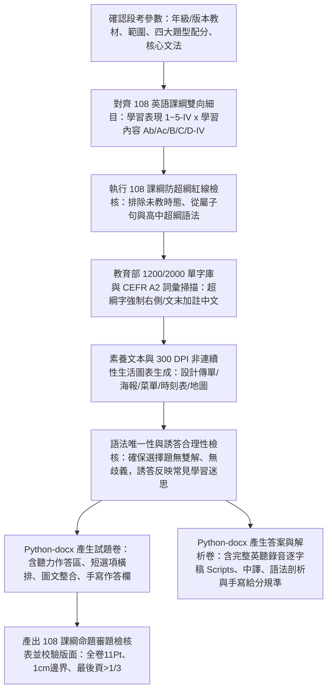

# 國中英語文 108 課綱素養命題規範與自動化產卷技能 (jhsh-english-exam-generator)

本 Skill 專門用於指導 Antigravity 代理人自動化命題，生成完全符應「新北市立錦和高級中學」國中部教務處/試務組規範，且深度結合**教育部《十二年國民基本教育課程綱要—語文領域-英語文（108 課綱）》**（核心素養 `英-J`、學習表現 `1/2/3/4/5-IV`、學習內容 `Ab/Ac/B/C/D-IV`、備註欄防超綱界線、學習評量實施要點）、臺師大心測中心「國中教育會考 (CAP) 英語科評量架構」與國際 CEFR A2 基礎級語言標準之正式英語段考試題卷、答案詳解卷（含聽力逐字錄音稿），以及命題審題雙向細目檢核表。

---

## 快速開始：使用者提詞標準模板 (User Prompt Template)

> [!TIP]
> **若使用者初次使用本技能或未指定細節，請主動引導使用者提供或修改以下標準段考參數：**

```text
請使用 /jhsh-english-exam-generator 技能為我生成一份國中英語科段考試卷，規格參數如下：
1、年級、版本與範圍：【例如：國中八年級下學期 康軒版 第 1 課至 第 2 課（包含 Review 1）】。
2、題型與配分：總分 100 分
   - 第一部分：聽力測驗【例如：辨識句意 3 題、基本問答 4 題、言談理解 3 題，共 10 題，每題 2 分，共 20 分】
   - 第二部分：綜合測驗（單題）【例如：15 題，每題 2 分，共 30 分，涵蓋核心字彙與當次語法句型】
   - 第三部分：克漏字與素養閱讀題組【例如：克漏字 1 組 4 題、生活素養閱讀 2 組共 8 題，共 12 題，每題 2.5 分，共 30 分，包含 1 組非連續性圖表或海報文本】
   - 第四部分：非選擇題（手寫題）【例如：文意字彙 5 題每題 2 分、依提示作答/句子改寫 2 題每題 3 分、中翻英 1 題 4 分，共 20 分，附手寫作答卷表格】
3、難易程度：【例如：難易適中偏難（預估通過率約 60%～65%，文法概念清晰，閱讀篇章具生活素養推論深度）】。
4、用字與圖表規範：嚴格遵循教育部 1200/2000 常用字彙與 CEFR A2 級標，超出範圍生詞於文末加註中文；圖表題請產出 300 DPI 高清生活資訊圖（海報/菜單/時刻表）。
5、輸出要求：輸出錦和高中標準 3 份獨立 Word 檔（試題卷、含完整英聽錄音稿之答案解析卷、命題審題檢核表）。
```

---

## 核心工作流程 (Workflow)



---

## 一、 錦和高中英語科試務組排版與格式標準規範

生成 Word (`.docx`) 檔案時，**必須嚴格遵循以下排版規則**：

1. **試題抬頭（粗體加底線）**：
   - 格式：<u>**新北市立錦和高級中學 11X學年度第X學期 國中部○年級英語科第○次段考試題**</u>
   - 次標題：﹝命題範圍：○○版第○冊第○課至第○課﹞、右上角標註「班級：____ 座號：__ 姓名：________」。
2. **必放注意事項（警語）**：
   - 答案卡警語（紅色粗體）：「**答案卷(卡)未寫班級、姓名、座號，或畫卡錯誤致電腦無法判讀考生身份者，一律扣 5 分**」。
   - 非選題手寫警語：「**第四部分非選擇題請使用黑色墨水筆於『答案卷指定欄位』內依序書寫，鉛筆作答或書寫於欄位外者不予計分**」。
   - 作答說明：清楚載明第一至三部分為電腦讀卡單選題（第 1～XX 題），第四部分為紙筆手寫非選題。
3. **英語科四大標準題型與版面設計**：
   - **第一部分：聽力測驗（Listening Comprehension，佔 20%～30%）**：
     - **一、辨識句意**：依據聽到的句子，選出符合描述的圖片（或簡短描述）。
     - **二、基本問答**：依據聽到的單一步驟問句，選出最適當的單句回應。
     - **三、言談理解**：依據聽到的對話或短文與隨後問題，選出正確答案。
     - 試題卷標註作答說明與音檔題號提示。
   - **第二部分：綜合測驗（單題文法與字彙，佔 25%～35%）**：
     - 題號凸排（`left_indent = 0.28 inch, first_line_indent = -0.28 inch`）。
     - **選項智慧並排規範（極致省紙）**：
       - 若四個選項皆為簡短單字、片語（長度 $\le 12$ 字元）：採用**「四選一列橫排」**（`(A) ...　　(B) ...　　(C) ...　　(D) ...`）。
       - 若選項為中等長度子句（長度 $13 \sim 25$ 字元）：採用**「兩選一列（2×2）」**。
       - 若選項為完整長句：採用**「單列排列（1 option per line）」**。
   - **第三部分：克漏字與素養閱讀題組（Cloze & Reading Comprehension，佔 30%～40%）**：
     - 篇章文本維持 **11 Pt**，段落行距 **1.15**，段落後留白 **2 Pt**。
     - 題組文章開頭加粗標註題號範圍，例如：`【題組：第 26～28 題】`。
     - **連續性文本**：日記、書信/Email、敘事短文、對話、科普簡介。
     - **非連續性文本**：廣告、活動海報、公車/火車時刻表、餐館菜單、商場折扣券、天氣預報表、網頁論壇留言。
     - 超綱生詞於篇章末尾或右下方以 `9.5 Pt` 標註中文（如：`* ingredient 食材　* preserve 保存`）。
   - **第四部分：非選擇題（手寫題，佔 15%～25%）**：
     - **一、文意字彙**：給首尾字母與空格底線（例如：`1. The weather is c______d today. Don't forget your jacket.`）。
     - **二、依提示作答 / 句子改寫**：測試關鍵句型轉換（如主被動轉換、合併句子、改為間接問句、原級/比較級轉換）。
     - **三、整句中翻英 / 情境短文填空**：評量完整句子組織與動詞時態一致性。
     - **自動產生標準「非選擇題手寫作答欄表格」**：於試題卷末尾（或獨立答案卷）自動建立規範作答格，標註題號與留白作答行。
4. **版面設定（Page Margins & Fonts）**：
   - **頁邊界**：上、下、左、右各 **1.0 cm**（0.3937 英吋）。
   - **字體**：英文正文一律使用 **Times New Roman**，中文說明與試卷標題使用 **標楷體**。
   - **字體大小**：主標題 13.5～14 Pt 粗體底線；大題標題 11.5 Pt 粗體；**全卷正文、題幹、選項、閱讀文本、聽力題目與詳解一律嚴格維持 11 點字 (11 Pt)**；生詞註腳 9.5 Pt；頁尾動態頁碼 10 Pt。
   - **行距**：1.15 倍行距，段落後間距 1.5～2 Pt。
   - **最後一頁控制**：最後一頁內容不可少於整頁的 1/3。

---

## 二、 聽力測驗錄音腳本 (Listening Scripts) 規範

解析卷中**必須提供完整且標準的英聽測驗錄音稿**，供任課教師播音、審題或印製聽力詳解。

### 1. 錄音稿結構標準
- **播音導言**：包含開頭考試說明、播放次數規定（「每題播音兩次，兩次之間間隔 5 秒」）。
- **角色標記**：對話必須明確標註發話角色（`M:` 代表成年男性, `W:` 代表成年女性, `B:` 代表男孩/學生, `G:` 代表女孩/學生）。
- **問題朗讀**：每道對話或短文後，必須明確列出播音問題（`Question: ...`）。

### 2. 錄音腳本範例格式
```text
【第一部分：辨識句意】
1. (播音) The boy is taking off his shoes at the door. (停頓5秒，再念一次)
   Question: Which picture best describes the sentence?
【第二部分：基本問答】
4. (播音) How often do you clean your bedroom? (停頓5秒，再念一次)
   (A) For two hours.  (B) Twice a month.  (C) In the morning.
【第三部分：言談理解】
8. (播音) 
   M: Hey, Lisa. Are you going to Kevin's birthday party tonight?
   W: I'd love to, but I have to study for tomorrow's math exam.
   M: Don't worry. The party ends early, around eight. You'll still have time.
   W: Well, then I can go for an hour.
   Question: Why didn't Lisa plan to go to the party at first?
```

---

## 三、 教育部 1200/2000 常用字彙與 CEFR A2 難度驗證防錯機制

> [!IMPORTANT]
> **國中教育會考與段考命題的最核心防線：字彙難度嚴格鎖定於教育部公佈之《國民中小學常用 2000 字詞表》（初階 1200 字為主，進階 800 字為輔），完全契合 CEFR A2 級標！**

1. **詞彙範圍檢核**：
   - 7 年級：嚴格以常用 1200 字詞為主，排除抽象名詞或進階複合字。
   - 8～9 年級：涵蓋教育部 2000 字詞，超出 2000 字表之專業字彙嚴格限制在全卷 3 個以內，且**必須在文章末尾右側加註中文**。
2. **生詞註腳規範**：
   - 格式：`* vocabulary 單字中文意思`，放置於該題或該題組篇章右下方，使用 9.5 Pt 標楷體。
3. **選擇題誘答選項合理性與唯一性**：
   - **唯一性**：每題四個選項只有一個完全符合文法、語境與語意邏輯，嚴禁出現兩個皆可通的爭議選項。
   - **診斷性誘答**：其餘 3 個誘答選項必須針對學生核心學習迷思（例如：主詞單複數動詞三單忘記加 s、過去式與完成式動詞變化混淆、形容詞與副詞混淆、動名詞與不定詞受詞誤用）。

---

## 四、 教育部《十二年國民基本教育英語文領域 108 課綱》核心規範與 7～9 年級防超綱紅線清單

代理人命題、撰寫詳解及產出「命題審題檢核表」時，必須嚴格對齊以下 108 課綱法規體系：

### 1. 英語文領域核心素養（第四學習階段 `英-J`）

| 核心素養面向 | 國民中學教育（第四學習階段 `英-J` 指標） | 命題落實要點 |
| :--- | :--- | :--- |
| **A1 身心素質與自我精進** | **`英-J-A1`** 具備積極的英語學習態度，能使用適當的學習策略提升語言能力。 | 評量自主學習、字典使用、筆記組織與自我反思之生活情境題。 |
| **A2 系統思考與解決問題** | **`英-J-A2`** 具備理解與使用英語的基本能力，能從多元訊息中歸納重點，解決生活問題。 | 閱讀圖表、交通時刻表、活動規則並進行多步驟推理與最佳決策。 |
| **A3 規劃執行與創新應變** | **`英-J-A3`** 能運用英語規劃個人生活行程、參與學校活動與社交互動。 | 旅行行程表規劃、派對邀約書信、活動預算與時間管理題目。 |
| **B1 符號運用與溝通表達** | **`英-J-B1`** 具備聽、說、讀、寫英語的基本溝通能力，能適切表達個人想法。 | 日常生活對話、社交禮儀、文字訊息、Email 與便條書寫。 |
| **B2 科技資訊與媒體素養** | **`英-J-B2`** 能運用網路資源與數位工具輔助英語學習，辨識常見網路訊息。 | 網路論壇留言、社群貼文、科技產品操作說明、辨別訊息真偽。 |
| **B3 藝術涵養與美感素養** | **`英-J-B3`** 能欣賞英語歌曲、童謠、短詩、故事與戲劇之美。 | 英文小故事、寓言、童謠韻腳、繪本情境對白。 |
| **C1 道德實踐與公民意識** | **`英-J-C1`** 能透過英語認識公共議題，培養環境保護、資源節約與社會關懷意識。 | 環保減塑海報、流浪動物認養、志工招募、節能生活短文。 |
| **C2 人際關係與團隊合作** | **`英-J-C2`** 能在小組合作中運用英語傾聽他人想法，進行友善互動。 | 校園分組報告對話、運動競賽合作、同理心溝通情境。 |
| **C3 多元文化與國際理解** | **`英-J-C3`** 能認識本國與外國的主要節慶習俗、文化差異與世界多元觀點。 | 異國飲食文化、各國新年慶典、文化禮節差異比較文本。 |

---

### 2. 「學習表現」五大構念編碼（第四學習階段 `IV`）

- **`1-IV` 聆聽能力**：
  - `1-IV-1` 能聽辨英語語音（如母音、子音、連音）。
  - `1-IV-2` 能聽懂常用教室用語與日常生活指令。
  - `1-IV-3` 能聽懂簡易的日常生活對話。
  - `1-IV-4` 能聽懂簡易故事或訊息的主旨與主要內容。
- **`2-IV` 口說能力**：
  - `2-IV-1` 能以簡易英語參與課堂問答與日常對話。
- **`3-IV` 閱讀能力**：
  - `3-IV-1` 能看懂常用標誌、告示與表格。
  - `3-IV-2` 能辨識篇章中關鍵字詞與核心訊息。
  - `3-IV-3` 能看懂簡易短文、故事的主旨（Main Idea）與細節（Details）。
  - `3-IV-4` 能藉由上下文（Context Clues）推測字詞涵義。
  - `3-IV-5` 能根據篇章內容進行合理的推論（Inference）。
  - `3-IV-6` 能整合多重文本或圖表資訊做出判斷。
- **`4-IV` 書寫能力**：
  - `4-IV-1` 能正確拼寫常用 1200 字詞。
  - `4-IV-2` 能依提示寫出文法正確的簡單句與複合句。
  - `4-IV-3` 能正確使用大小寫與標點符號。
  - `4-IV-4` 能簡短書寫個人日常生活經驗或便條。
- **`5-IV` 語言與綜合應用能力**：
  - `5-IV-1` 能整合聽讀資訊，進行語法分析與意義建構。

---

### 3. 「學習內容」與【7～9 年級嚴格防超綱紅線清單】

> [!CAUTION]
> **國中段考命題紀律：嚴格遵守課綱各年級語法階梯，禁止提前出現高年級或高中文法！**

#### （1）國中 7 年級（七上、七下）命題範疇與嚴格禁區
- **核心範圍**：人稱代名詞、be 動詞現在式、名詞單複數、指示代名詞、所有格、祈使句、現在進行式（`be + V-ing`）、There is/are 存在句、助動詞 can、一般動詞現在式（含第三人稱單數加 s/es）、時間介系詞（at, in, on）、頻率副詞（always, usually, often, sometimes, never）。
- **🚫 7 年級嚴格禁區（不得超綱）**：
  1. **嚴禁考「過去式」（`did / was / were / Ved`）或「未來式」（`will / be going to`）**（屬於 8 年級範圍）。
  2. **嚴禁考「授與動詞」（give, send, buy）或「連綴動詞」（look, taste, smell, become）**。
  3. **嚴禁考動名詞或不定詞當受詞之用法**。
  4. **嚴禁考形容詞／副詞之比較級與最高級**。
  5. 句子長度嚴格控制在單一獨立子句，**不出現對等連接詞以外的從屬子句（如 when, because, if）**。

#### （2）國中 8 年級（八上、八下）命題範疇與嚴格禁區
- **核心範圍**：一般動詞過去式（規則與不規則動詞變化）、過去進行式、未來式（`will / be going to`）、天氣問答、授與動詞（雙賓動詞：人物代換介系詞 to/for）、連綴動詞、動名詞（V-ing 作主詞/受詞/介系詞受詞）與不定詞（to V）、形容詞與副詞比較級與最高級（`-er, -est, more, most`）、原級比較（`as... as`）、對等與從屬連接詞（when, while, before, after, because, although, if, so）。
- **🚫 8 年級嚴格禁區（不得超綱）**：
  1. **嚴禁考「現在完成式」（`have / has + p.p.`）**（已移至 9 年級）。
  2. **嚴禁考「被動語態」（`be + p.p.`）**（已移至 9 年級）。
  3. **嚴禁考「名詞子句」或「間接問句」**（已移至 9 年級）。
  4. **嚴禁考「關係代名詞」（who, which, that）引導之形容詞子句**。
  5. **嚴禁考使役動詞（make, have, let）搭配原形動詞或感官動詞之進階受詞補語語法**（若當次教材未教）。

#### （3）國中 9 年級（九上、九下）命題範疇與嚴格禁區
- **核心範圍**：被動語態（現在/過去/未來式被動語態）、現在完成式（表經驗/持續/完成，搭配 since/for/already/yet）、使役動詞與感官動詞、名詞子句（that 引導、whether/if 引導、wh- 疑問詞引導之轉移間接問句）、附加問句（Tag Questions）、關係代名詞（who, which, that 主格與受格用法）、複合形容詞。
- **🚫 9 年級嚴格命題禁區（高中超綱語法，段考與會考絕對禁止）**：
  1. **嚴禁考「分詞構句」（Participle Clauses）**（如 `Seeing the police, the thief ran away.`）。
  2. **嚴禁考「倒裝句」（Inversion）**（如 `Not only did he...`, `Never have I seen...`）。
  3. **嚴禁考「非限定關係代名詞」（Non-defining Relative Clauses，逗號關代補充說明）**。
  4. **嚴禁考「複合關係代名詞 what」或「關代省略與準關代 as, but」**。
  5. **嚴禁考「假設語氣」（Subjunctive Mood / 虛擬法，如 `If I were you, I would...`）**（國中 108 課綱僅限真實條件句 `If it rains tomorrow, we will...`）。
  6. **嚴禁考「過去完成式」（`had + p.p.`）**。

---

## 五、 臺師大心測中心「國中教育會考 (CAP)」素養評量架構與給分規準

### 1. 閱讀理解三大能力層次（納入審題檢核表）
- **L1 擷取資訊（Locating & Retrieving）**：直接在文本中找到明確的事實、時間、人名、地點或單一資訊。
- **L2 統整解釋（Integrating & Interpreting）**：
  - 主旨大意（Main idea of the reading）。
  - 代名詞指涉（What does "it" / "they" refer to?）。
  - 由上下文推敲生詞涵義（Contextual vocabulary clue）。
  - 因果關係推理（Cause and effect）。
- **L3 反思評鑑（Reflecting & Evaluating）**：
  - 判斷作者寫作目的或語氣態度（Author's purpose, tone, or attitude）。
  - 整合圖表資訊與長文敘述，評估不同方案的優缺點並做出判斷。

### 2. 非選擇題（手寫題）標準給分規準 (Rubrics)
- **文意字彙（每題 1～2 分）**：
  - 拼字、詞性、單複數或動詞時態變化完全正確：得滿分。
  - 拼字錯誤或未依句意變化（如漏加 -s, -ed）：0 分。
- **依提示作答 / 句子改寫（每題 2～3 分）**：
  - 句型結構正確、主要動詞與主詞一致無誤：得滿分。
  - 核心句型正確，僅拼字、大小寫或標點符號微小瑕疵：每處扣 0.5 分。
  - 關鍵文法或句型結構錯誤（如關係代名詞誤用、時態錯誤）：0 分。
- **整句中翻英（每題 3～4 分）**：
  - 採分段給分：前半句（核心動詞/主詞）2 分，後半句（介系詞/受詞/修飾語）2 分。
  - 拼字錯誤每字扣 0.5 分，扣完該子題分數為止。

---

## 六、 300 DPI 非連續性生活圖表與向量排版

英語會考每年必考非連續性文本（Non-continuous Texts）。使用 Python `matplotlib` 產生生活資訊圖表時，需遵循以下規範：

1. **視覺風格**：
   - 採用 **高對比黑白灰階風格**（`#F2F2F2` 淺灰底色、黑框線、深灰標題欄），確保學校高速油印清晰。
2. **字體標準**：
   - 英文使用 **Arial** 或 **DejaVu Sans**，中文字體使用 **Microsoft JhengHei**。
   - 標題 **16～18 Pt Bold**，圖表內文 **12～14 Pt**，避免字級過小油印模糊。
3. **長寬比例**：
   - 預設寬高比 `figsize=(7.5, 4.5)`，輸出解析度 `dpi=300`。

---

## 七、 錦和高中標準排版 Python-docx 產生核心程式碼

撰寫產卷腳本時，直接調用以下核心函式建立符合錦和規範之試卷：

```python
import docx
from docx.shared import Inches, Pt, RGBColor
from docx.enum.text import WD_ALIGN_PARAGRAPH
from docx.enum.table import WD_TABLE_ALIGNMENT
from docx.oxml import parse_xml, OxmlElement
from docx.oxml.ns import nsdecls, qn

def create_jhsh_exam_document():
    doc = docx.Document()
    for section in doc.sections:
        # 1.0 cm 頁邊界 (0.3937 inch)
        section.top_margin = Inches(0.3937)
        section.bottom_margin = Inches(0.3937)
        section.left_margin = Inches(0.3937)
        section.right_margin = Inches(0.3937)
        section.different_first_page_header_footer = False
        
        # 頁尾動態頁碼：〔第 X 頁，共 Y 頁〕
        footer_p = section.footer.paragraphs[0]
        footer_p.alignment = WD_ALIGN_PARAGRAPH.CENTER
        set_dynamic_page_number(footer_p)
    return doc

def set_dynamic_page_number(paragraph):
    """置中加入動態 Word 頁尾：〔第 X 頁，共 Y 頁〕"""
    r1 = paragraph.add_run("〔第 ")
    r1.font.name = "Times New Roman"
    r1._element.rPr.rFonts.set(qn('w:eastAsia'), '標楷體')
    r1.font.size = Pt(10)
    
    fld1 = parse_xml(r'<w:fldSimple %s w:instr="PAGE"/>' % nsdecls('w'))
    paragraph._p.append(fld1)
    
    r2 = paragraph.add_run(" 頁，共 ")
    r2.font.name = "Times New Roman"
    r2._element.rPr.rFonts.set(qn('w:eastAsia'), '標楷體')
    r2.font.size = Pt(10)
    
    fld2 = parse_xml(r'<w:fldSimple %s w:instr="NUMPAGES"/>' % nsdecls('w'))
    paragraph._p.append(fld2)
    
    r3 = paragraph.add_run(" 頁〕")
    r3.font.name = "Times New Roman"
    r3._element.rPr.rFonts.set(qn('w:eastAsia'), '標楷體')
    r3.font.size = Pt(10)

def add_jhsh_header(doc, semester="114學年度第二學期", grade="八", subject="英語科", exam_time="第一次段考", scope="康軒版 第三冊 Unit 1 ~ Unit 2"):
    """加入錦和高中標準試題抬頭與警語"""
    # 主標題
    p_title = doc.add_paragraph()
    p_title.alignment = WD_ALIGN_PARAGRAPH.CENTER
    p_title.paragraph_format.space_before = Pt(0)
    p_title.paragraph_format.space_after = Pt(2)
    run_t = p_title.add_run(f"新北市立錦和高級中學 {semester} 國中部{grade}年級{subject}{exam_time}試題")
    run_t.font.name = "Times New Roman"
    run_t._element.rPr.rFonts.set(qn('w:eastAsia'), '標楷體')
    run_t.font.size = Pt(14)
    run_t.font.bold = True
    run_t.font.underline = True

    # 範圍與個人資訊
    p_sub = doc.add_paragraph()
    p_sub.paragraph_format.space_after = Pt(4)
    r_scope = p_sub.add_run(f"﹝命題範圍：{scope}﹞")
    r_scope.font.name = "Times New Roman"
    r_scope._element.rPr.rFonts.set(qn('w:eastAsia'), '標楷體')
    r_scope.font.size = Pt(11)
    r_scope.font.bold = True
    
    r_info = p_sub.add_run("　　班級：________ 座號：____ 姓名：____________")
    r_info.font.name = "Times New Roman"
    r_info._element.rPr.rFonts.set(qn('w:eastAsia'), '標楷體')
    r_info.font.size = Pt(11)

    # 警語
    p_warn = doc.add_paragraph()
    p_warn.paragraph_format.space_after = Pt(6)
    r_w1 = p_warn.add_run("★ 注意事項：答案卷(卡)未寫班級、姓名、座號，或畫卡錯誤致電腦無法判讀考生身份者，一律扣 5 分。非選擇題請用黑色墨水筆作答，違者扣非選總分 5 分。")
    r_w1.font.name = "Times New Roman"
    r_w1._element.rPr.rFonts.set(qn('w:eastAsia'), '標楷體')
    r_w1.font.size = Pt(10.5)
    r_w1.font.bold = True
    r_w1.font.color.rgb = RGBColor(192, 0, 0)

def add_hanging_paragraph(doc, text, left_inch=0.28, first_inch=-0.28):
    """加入題號凸排段落 (全卷 11 點字)"""
    p = doc.add_paragraph()
    p.paragraph_format.left_indent = Inches(left_inch)
    p.paragraph_format.first_line_indent = Inches(first_inch)
    p.paragraph_format.space_after = Pt(2)
    p.paragraph_format.line_spacing = 1.15
    run = p.add_run(text)
    run.font.name = "Times New Roman"
    run._element.rPr.rFonts.set(qn('w:eastAsia'), '標楷體')
    run.font.size = Pt(11)
    return p
```

---

## 八、 獨立三份 Word 檔案產出規範與自我檢核清單 (Checklist)

每次執行本技能時，必須在指定目錄產出以下 **3 份獨立 `.docx` 檔案**：

1. `[學期][年級]英語段[次]試題.docx`（含第一部分聽力測驗、第二部分單題文法字彙、第三部分克漏字與閱讀題組、第四部分非選題作答表格）
2. `[學期][年級]英語段[次]答案與解析.docx`（含標準答案速查表、**完整英聽錄音逐字稿 Scripts**、各題對應之 108 課綱學習表現/學習內容編碼、中文翻譯、詳細文法剖析、誘答迷思解析、手寫題 0～3 級分標準）
3. `[學期][年級]英語段[次]命題審題檢核表.docx`（含 108 英語文課綱「學習表現 × 學習內容 × 核心素養」雙向細目表、會考閱讀歷程分佈、防超綱自檢與試務審題檢核表）

### 產卷完畢必做檢核清單：
- [ ] 是否已逐題檢核 **108 英語課綱各年級防超綱紅線**（7年級無過去/未來式、8年級無被動/完成式/關代、9年級無分詞構句/倒裝句/虛擬法）？
- [ ] 全卷單字是否嚴格符合 **教育部 1200/2000 字表與 CEFR A2**？超出之專有詞是否已於文末加註中文？
- [ ] 聽力測驗是否附有完整、標準的 **錄音逐字稿 (Listening Scripts)** 與播音停頓秒數提示？
- [ ] 選擇題選項是否為唯一正解，誘答選項是否具備診斷價值且無語法爭議？
- [ ] 簡短選項是否已採用「四選一列」或「兩選一列」智慧橫排以落實錦和高中省紙規範？
- [ ] 是否包含錦和高中標準粗體底線抬頭、紅字扣 5 分警語、全卷 11 Pt Times New Roman／標楷體、1cm 邊界、題號凸排與動態頁尾 `〔第 X 頁，共 Y 頁〕`？
- [ ] 手寫非選擇題是否提供標準作答欄表格，解析卷是否附上 0～3 級分給分規準？
- [ ] 最後一頁版面是否大於 1/3 頁？
